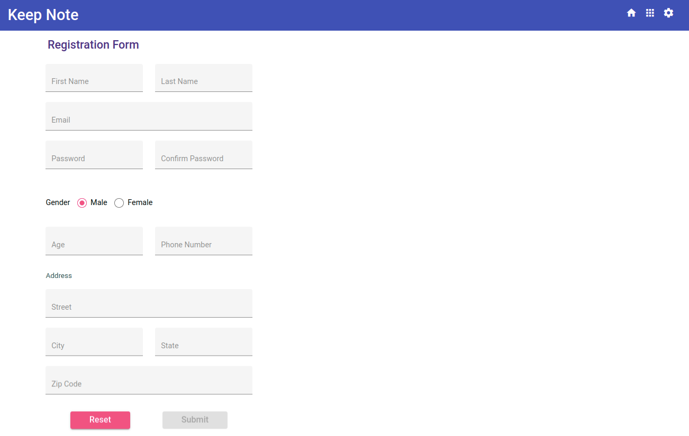
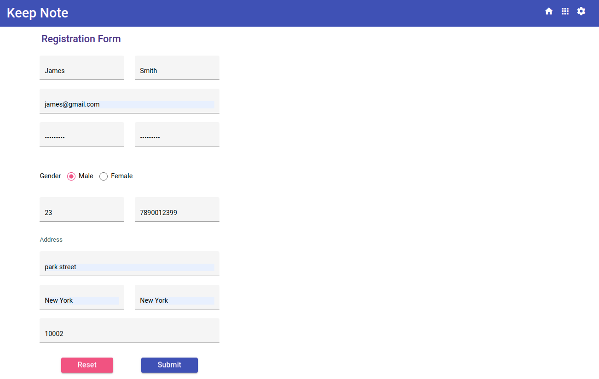
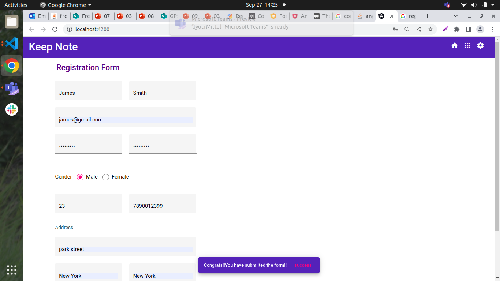

## Challenge - Develop a reactive form to register a user for Keep Note application

### Context

Keep Note is a web app that allows users to maintain notes. The app should be designed as a single-page application. ​

The app should be developed by creating components based on the SPA approach. ​

The first four phases of development are completed. During these four phases, the components are created to add, view, and search notes. The persistence has been implemented, and notes are added and retrieved from the server. The components are styled using Angular material. ​

By making HTTP calls to json-server, notes are fetched from and saved in the `.json` file.​

In phase 5, a user registration form should be created for registering a new user using Angular Reactive forms. To make the Keep Note application more secure, these registered users can then be asked to log in before accessing the various services provided by it.

## Problem Statement

Develop a user registration form to add a new user. The data model for user should include properties like firstName, lastName, password, confirmPassword, gender, age, email, phone and address. Address property should contain details like street, city, state and zipCode.

The reactive form created should resemble the following images.

**Registration Form**

**Registration Form With Validation Errors**

**Registration Form With Valid Values**

**Successful Form Submission**

#### Points To Remember
- In phase 5 development, the solution created for the Keep Note application in the previous sprint `Develop Interactive Template-Driven Forms Inside SPA` must be used.​
- A new Registration component should be created for developing the registration form. The landing page for the Keep Note application should be the newly developed Registration component.​
- This component will be used in the next following Angular Routing sprints to integrate with the existing Keep Note application.​
- Angular Reactive form should be created to add a new user. The form input elements must be created using Angular material components​
- All the required modules to work with Angular forms and material components should be imported in the application root module.​
- Use formGroup and formControl directives to bind the form model with template.​
- Use built-in and custom validator functions to validate form input values. ​
- Custom validator functions should be added for ​
    - Validating the age field (Single field validator)​
    - Checking the equality for password and confirmPassword values. (Multi-field validator)​
- Use <mat-error> to display validation error messages.​
- Custom styles should be added while designing the form.​
- The newly added user should be saved in `users.json` file in the `keep-note-data` folder  using User service.
